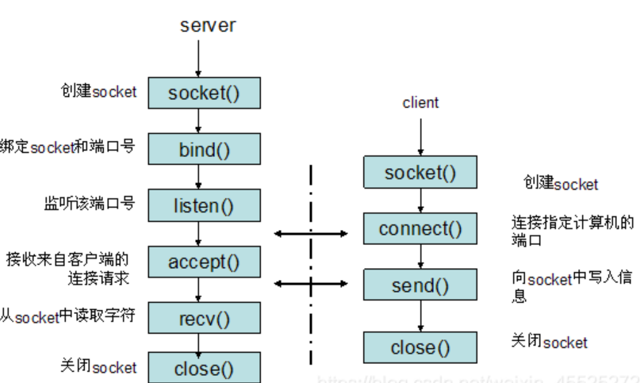
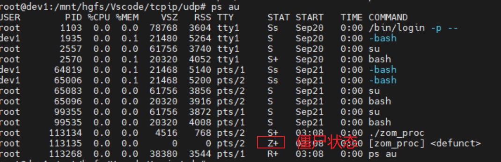

## TCP服务端的默认函数调用顺序
socket() --> bind()  --> listen()  -->  accept()  -->  read()/write()  -->  close()
创建套接字--> 分配套接字地址 --> 等待连接请求状态 --> 允许连接 --> 数据交换() --> 断开连接()

## 客户端的默认函数调用顺序
socket() --> connect()  -->  read()/write()  -->  close()
创建套接字--> 请求连接 --> 数据交换() --> 断开连接()
客户端的IP地址和端口在调用connect函数时自动分配，无需调用标记的bind函数进行分配


## 协议族（Protocol Family）
- PF_INET
- PF_INET6
- PF_LOCAL
- PF_PACKET
- PF_IPX

---

## 套接字类型（Type）
- SOCK_STREAM ：是基于TCP的有保障的(即能保证数据正确传送到对方)面向连接的SOCKET，多用于资料(如文件)传送。

- SOCK_DGRAM : 基于UDP的无保障的面向消息的socket ， 主要用于在网络上发广播信息。

INADDR_ANY ：连接到本地地址

## 端口号
0 ~ 65535 ，0 ~ 1023是知名端口， TCP和UDP可以使用同一个端口号


## I/O缓冲
口 I/O缓冲在每个TCP套接字中单独存在。
口 I/O缓冲在创建套接字时自动生成。
口 即使关闭套接字也会继续传递输出缓冲中遗留的数据。
口 关闭套接字将丢失输入缓冲中的数据。

TCP中有滑动窗口，不会发生超过输入缓冲大小的数据传输。 


## UDP
流控制是区分UDP和TCP的最重要的标志，若要传递压缩文件(发送1万个数据包时，只要丢失1个就会产生问题)，则必须使用TCP。但对于多媒体数据(网络实时传输音视频)，则需要UDP

必须在UDP通信过程中使收发端的I/O函数调用次数保持一致。


## 域名
一旦注册域名时能永久不变，每次运行程序时根据域名获取TP地址，再接入服务器，这样程序就不会依赖于服务器IP地址了，程序中也需要IP地址和域名之间的转换函数 。

先断开连接(发送FIN)的套接字必然会经过Time-Wait过程。

## Nagle算法
只有收到前一数据的ACK消息时，Nagle算法才发送下一数据。此时发送的数据是经过缓冲的较长的数据，可以减少网络传输次数。
但如果传输大文件数据，不使用Nagle算法不仅不会增加数据包的数量，还无需等待ACK的前提下连续传输，可以大大提高传输速度。

# 套接字可选项
1. 协议层(SOL_SOCKET)
- SO_SNDBUF ： 输出缓冲大小
- SO_RCVBUF ： 输入缓冲大小
- SO_REUSEADDR ： 如果服务端先断开连接，由于time-wait再重新bind socket时会失败，可以通过该参数置1将端口号重新分配给新的套接字。
- SO_KEEPALIVE
- SO_BROADCAST
- SO_DONTROUT
- SO_OOBINLINE
- SO_ERROR
- SO_TYPE  ：查看套接字类型(TCP 1或UDP 2)，该TYPE在创建时决定，不可更改

2. IP协议层(IPPROTO_IP)
- IP_TOS
- IP_TTL
- IP_MULTICAST_TTL
- IP_MULTICAST_LOOP
- IP_MULTICAST_IF

3. IPPROTO_TCP
- TCP_KEEPALIVE
- TCP_NODELAY ： 查看是否启用nagle算法。
- TCP_MAXSEG

可以通过getsocketop()和setsocketopt()读取和设置可选项。

# 多进程服务器
并发服务器实现方法：
1. 多进程服务器： 创建多个进程提供服务(不适合在Windows下)
2. 多路复用服务器： 捆绑并统一管理I/O对象提供服务
3. 多线程服务器： 生成与客户端等量的线程提供服务

## 多进程服务器
通过ps au查看进程ID

通过fork()函数创建进程，区分父、子进程方法：
    - 父进程： fork函数返回子进程ID
    - 子进程： fork函数返回0
调用fork()函数后，父子进程拥有完全独立的内存结构。

### 僵尸进程
如果父进程未主动要求获得子进程的结束状态值，操作系统将一直保存，并让子进程长时间处于僵尸进程状态。也就是说，父进程要负责收回子进程。

> 执行 'ps au'命令，如果STAT状态为Z+，表示是僵尸线程。

防止僵尸进程的方法：
1. **使用wait()函数**，调用wait函数时，如果没有己终止的子进程，那么程序将阻塞(Blocking)直到有子进程终止，才会继续执行，因此需谨慎调用该函数。
2. **使用waitpid()函数**, 调用waitpid函数时，程序不会阻塞。如果没有终止的子进程，则会返回0。

### 信号处理（Singal Handling）
“信号”是在特定时间发生时由操作系统向进程发送的消息。为了响应该消息，执行与消息相关的自定义操作的过程称为“信号处理”。

```c
// 信号注册函数指针，现在很少用signal在不同UNIX系列可能存在区别，sigaction则完全相同
void (*signal(int signo, void (*func)(int)))(int);
int sigaction(int signo, const struct sigaction * act, struct sigaction *oldact) ;
/*signo value
 *  SIGALRM: 到达调用alarm函数注册的时间
 *  SIGINT : 输入了CTRL+C
 *  SIGCHLD: 子进程终止 
*/
// 调用该函数的同时向它传递一个正整型参数，相应时间后(以秒为单位)将产生SIGALRM信号，若向该函数传递0，则之前对SIGALRM信号的预约将取消。 
unsigned int alarm(unsigned int seconds);
```

#### 后台处理
```bash
# 执行程序时加上'&'符号，程序将在后台运行
./zom_proc &
```


## 基于多任务的并发服务器


# 函数
```C
struct sockaddr_in {
    sa_family_t    sin_family; /* address family: AF_INET */
    in_port_t      sin_port;   /* port in network byte order */
    struct in_addr sin_addr;   /* internet address */
};
/* Internet address. */
struct in_addr {
    uint32_t       s_addr;     /* address in network byte order */
};
struct sockaddr_in     servaddr;  
memset(&servaddr, 0, sizeof(servaddr));  
servaddr.sin_family = AF_INET;  
servaddr.sin_addr.s_addr = htonl(INADDR_ANY);//IP地址设置成INADDR_ANY,让系统自动获取本机的IP地址。  
servaddr.sin_port = htons(DEFAULT_PORT);//设置的端口


/* socket()用于创建一个socket描述符（socket descriptor），它唯一标识一个socket */

/* domain：即协议域，又称为协议族（family）。常用的协议族有，AF_INET（IPv4)、AF_INET6(IPv6)、AF_LOCAL（或称AF_UNIX，Unix域socket）、AF_ROUTE等等。协议族决定了socket的地址类型，在通信中必须采用对应的地址，如AF_INET决定了要用ipv4地址（32位的）与端口号（16位的）的组合、AF_UNIX决定了要用一个绝对路径名作为地址。 */


/* type：指定socket类型。常用的socket类型有，SOCK_STREAM（流式套接字）、SOCK_DGRAM（数据报式套接字）、SOCK_RAW、SOCK_PACKET、SOCK_SEQPACKET等等 */

/* protocol：就是指定协议。常用的协议有，IPPROTO_TCP、PPTOTO_UDP、IPPROTO_SCTP、IPPROTO_TIPC等，它们分别对应TCP传输协议、UDP传输协议、STCP传输协议、TIPC传输协议, 当protocol为0时，会自动选择type类型对应的默认协议。 */

int socket(int domain, int type, int protocol);


struct sockaddr{
    sa_family_t  sin_family;   //地址族（Address Family），也就是地址类型
    char         sa_data[14];  //IP地址和端口号
};


struct sockaddr_in6 { 
    sa_family_t     sin6_family;   /* AF_INET6 */ 
    in_port_t       sin6_port;     /* port number */ 
    uint32_t        sin6_flowinfo; /* IPv6 flow information */ 
    struct in6_addr sin6_addr;     /* IPv6 address */ 
    uint32_t        sin6_scope_id; /* Scope ID (new in 2.4) */ 
};

struct in6_addr {
unsigned char s6_addr[16]; /* IPv6 address */
};
/*
sockfd：即socket描述字，它是通过socket()函数创建了，唯一标识一个socket。bind()函数就是将给这个描述字绑定一个名字。
addr：一个const struct sockaddr *指针，指向要绑定给sockfd的协议地址。
addrlen：对应的是地址的长度。
*/
int bind(int sockfd, const struct sockaddr *addr, socklen_t addrlen);
/* 返回值：如无错误发生，则bind()返回0。否则的话，将返回-1，应用程序可通过WSAGetLastError()获取相应错误代码。*/


/* 如果作为一个服务器，在调用socket()、bind()之后就会调用listen()来监听这个socket，如果客户端这时调用connect()发出连接请求，服务器端就会接收到这个请求。 */
/*
sockfd  : 第一个参数即为要监听的socket描述字，
backlog : 第二个参数为相应socket可以排队的最大连接个数。
返回值  ：如无错误发生，listen()返回0。否则的话，返回-1，应用程序可通过WSAGetLastError()获取相应错误代码。
*/
int listen(int sockfd, int backlog);


/* 
返回值：
若无错误发生，则connect()返回0。否则的话，返回SOCKET_ERROR错误，应用程序可通过WSAGetLastError()获取相应错误代码。对非阻塞套接口而言，若返回值为SOCKET_ERROR则应用程序调用WSAGetLastError()。如果它指出错误代码为WSAEWOULDBLOCK，则您的应用程序可以：

用select()，通过检查套接口是否可写，来确定连接请求是否完成。
如果您的应用程序使用基于消息的WSAAsyncSelect()来表示对连接事件的兴趣，则当连接操作完成后，您会收到一个FD_CONNECT消息。
*/
int connect(int sockfd, const struct sockaddr *addr, socklen_t addrlen);


/* 
TCP服务器端依次调用socket()、bind()、listen()之后，就会监听指定的socket地址了。TCP客户端依次调用socket()、connect()之后就向TCP服务器发送了一个连接请求。TCP服务器监听到这个请求之后，就会调用accept()函数取接收请求，这样连接就建立好了。之后就可以开始网络I/O操作了，即类同于普通文件的读写I/O操作。
 */

/* 返回值：
如果没有错误产生，则accept()返回一个描述所接受包的SOCKET类型的值。否则的话，返回INVALID_SOCKET错误，应用程序可通过调用WSAGetLastError()来获得特定的错误代码。 */
int accept(int sockfd, struct sockaddr *addr, socklen_t *addrlen);


#include <unistd.h>
/*
read函数是负责从fd中读取内容。当读成功时，read返回实际所读的字节数，如果返回的值是0表示已经读到文件的结束了，小于0表示出现了错误。如果错误为EINTR说明读是由中断引起的，如果是ECONNREST表示网络连接出了问题。
*/
ssize_t read(int fd, void *buf, size_t count);

/*
write函数将buf中的nbytes字节内容写入文件描述符fd。成功时返回写的字节数。失败时返回-1，并设置errno变量。 在网络程序中，当我们向套接字文件描述符写时有两种可能。
1)write的返回值大于0，表示写了部分或者是全部的数据。 2)返回的值小于0，此时出现了错误。我们要根据错误类型来处理。如果错误为EINTR表示在写的时候出现了中断错误。如果为EPIPE表示网络连接出现了问题(对方已经关闭了连接)。
*/
ssize_t write(int fd, const void *buf, size_t count);
#include <sys/types.h>
#include <sys/socket.h>

/*
recv函数和send函数提供了read和write函数一样的功能，不同的是他们提供了四个参数。前面的三个参数和read、write函数是一样的。
*/

/*
第四个参数一般置0。或者是以下组合：
MSG_DONTROUTE：不查找表，是send函数使用的标志，这个标志告诉IP，目的主机在本地网络上，没有必要查找表，这个标志一般用在网络诊断和路由程序里面。
MSG_OOB：表示可以接收和发送带外数据。
MSG_PEEK：查看数据，并不从系统缓冲区移走数据。是recv函数使用的标志，表示只是从系统缓冲区中读取内容，而不清楚系统缓冲区的内容。这样在下次读取的时候，依然是一样的内容，一般在有个进程读写数据的时候使用这个标志。
MSG_WAITALL：等待所有数据，是recv函数的使用标志，表示等到所有的信息到达时才返回，使用这个标志的时候，recv返回一直阻塞，直到指定的条件满足时，或者是发生了错误。
*/
ssize_t recv(int sockfd, void *buf, size_t len, int flags);
ssize_t send(int sockfd, const void *buf, size_t len, int flags);
ssize_t sendto(int sockfd, const void *buf, size_t len, int  flags,const struct sockaddr *dest_addr, socklen_t addrlen);
ssize_t recvfrom(int sockfd, void *buf, size_t len, int flags,
                 struct sockaddr *src_addr, socklen_t *addrlen);
ssize_t sendmsg(int sockfd, const struct msghdr *msg, int flags);
ssize_t recvmsg(int sockfd, struct msghdr *msg, int flags);

struct timeval {  
int tv_sec;     //seconds  
int tv_usec;    //microseconds，注意这里是微秒不是毫秒  
}; 

int select(int maxfdp,fd_set *readfds,fd_set *writefds,fd_set *errorfds,struct timeval*timeout); 

int close(int sockfd);   
/*
SHUT_RD  : 断开输入流
SHUT_WR  : 断开输出流
SHUT_RDWR：同时断开I/O流 
*/
int shutdown(int sock, int howto);  

/* 成功时远回 hostent 结构体地址 ，失败时返回 NULL 指针。 */
struct hostent * gethostbyname(const char、* hostname);

int getsockopt(int sock, int level, int optname, void *optval, socklen_t *optlen);
int setsockopt(int sock, int level, int optname, const void *optval, socklen_t optlen);
```